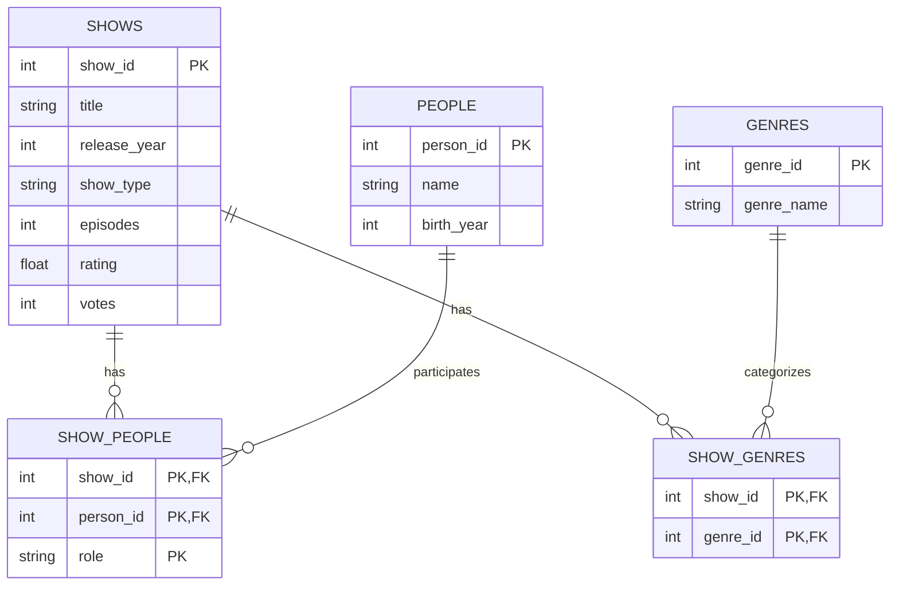

```mermaid
erDiagram
    SHOWS ||--o{ SHOW_PEOPLE : has
    PEOPLE ||--o{ SHOW_PEOPLE : participates
    SHOWS ||--o{ SHOW_GENRES : has
    GENRES ||--o{ SHOW_GENRES : categorizes

    SHOWS {
        int show_id PK
        string title
        int release_year
        string show_type
        int episodes
        float rating
        int votes
    }

    PEOPLE {
        int person_id PK
        string name
        int birth_year
    }

    SHOW_PEOPLE {
        int show_id PK,FK
        int person_id PK,FK
        string role PK
    }

    GENRES {
        int genre_id PK
        string genre_name
    }

    SHOW_GENRES {
        int show_id PK,FK
        int genre_id PK,FK
    }
```
